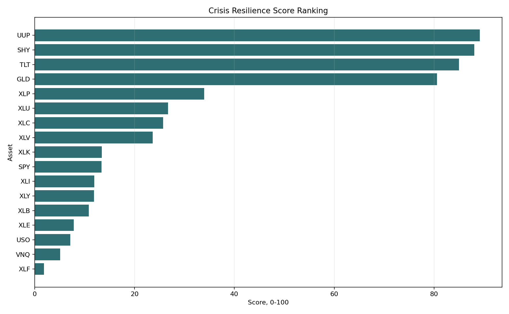
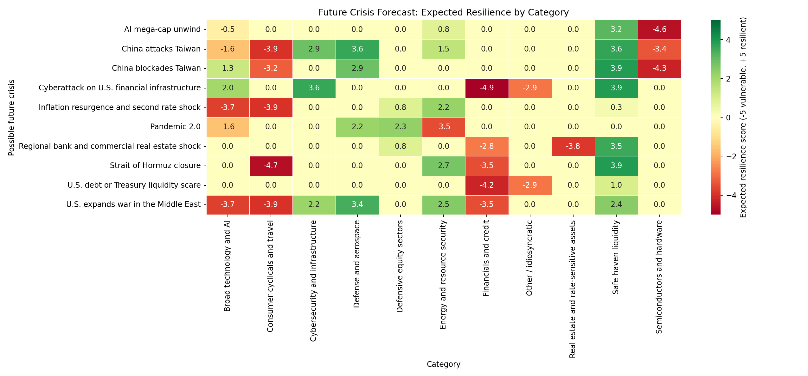
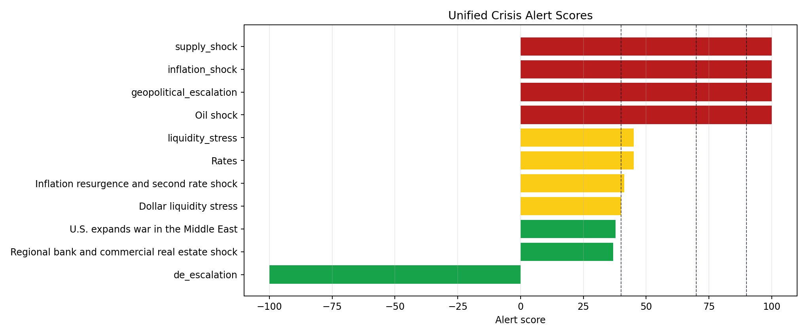

# Crisis Resilience Market Model

This Python project backtests how selected sector ETFs and asset classes behaved during major historical crisis periods, then compares each asset against the S&P 500 benchmark ETF, `SPY`.

The model is a historical decision-support tool. It does not predict future returns and does not guarantee that an asset will protect capital in the next crisis. Nothing in this project is investment advice.

## Demo Preview

Historical crisis resilience ranking:



Future crisis category forecast:



Unified alert layer:



The project also includes a historical visualization layer that annotates the crisis windows with wars, geopolitical shocks, industries that fell, resources that gained importance, company winners, and technology themes that benefited or improved.

It now includes a direct macro and alerting layer:

- FRED macro series: CPI, Fed funds, 2Y/10Y yields, VIX, credit spreads, unemployment, and financial stress indexes.
- Live RSS headline classification for geopolitical escalation, supply shock, inflation shock, liquidity stress, cyber shock, and de-escalation.
- Scenario calibration using historical analogs and current alert signals.
- Monte Carlo scenario paths that estimate stress-return proxies for the active portfolio.
- A unified alerts feed that flags regime changes across VIX, credit spreads, oil, dollar, rates, news, and scenario weights.
- A future crisis resilience forecast that maps each possible crisis to expected resilient, vulnerable, and path-dependent categories.

It also includes a forward-looking scenario stress layer for hypothetical shocks such as:

- China attacks Taiwan
- China blockades Taiwan
- The U.S. expands war in the Middle East
- Strait of Hormuz closure
- U.S. debt or Treasury liquidity scare
- regional bank and commercial real estate shock
- pandemic 2.0
- inflation resurgence and second rate shock
- cyberattack on U.S. financial infrastructure
- AI mega-cap unwind

The scenario layer uses transparent analyst-defined assumptions, not a machine-learning forecast or price target.

## How To Interpret The Model

Use the model to answer questions like:

- Which assets historically preserved capital better than `SPY` during crisis windows?
- Which sectors repeatedly struggled during drawdowns, inflation shocks, and liquidity shocks?
- Which categories are expected to be resilient or vulnerable under a specific future crisis?
- How does a portfolio map to the model's scenario stress assumptions?
- Which macro, news, or market alerts should trigger closer review?

Do not use the model as:

- A trading signal
- A market-timing engine
- A prediction of future returns
- A guarantee that a hedge will work
- A substitute for risk management or financial advice

## Assets Analyzed

Benchmark:

- `SPY`: S&P 500

Sector ETFs:

- `XLK`: Technology
- `XLF`: Financials
- `XLE`: Energy
- `XLU`: Utilities
- `XLV`: Healthcare
- `XLP`: Consumer Staples
- `XLI`: Industrials
- `XLY`: Consumer Discretionary
- `XLB`: Materials
- `XLC`: Communication Services

Asset classes:

- `GLD`: Gold
- `TLT`: Long-term Treasuries
- `SHY`: Short-term Treasuries
- `USO`: Oil
- `UUP`: U.S. Dollar
- `VNQ`: Real Estate

## Crisis Windows

The included crisis windows are defined in `crisis_periods.py`:

- 2008 Global Financial Crisis: 2007-10-09 to 2009-03-09
- 2011 Debt Ceiling and Eurozone Stress: 2011-07-22 to 2011-10-03
- 2015-2016 China and Oil Growth Scare: 2015-08-18 to 2016-02-11
- 2018 Q4 Fed Tightening and Trade War: 2018-09-20 to 2018-12-24
- 2020 COVID Crash: 2020-02-19 to 2020-03-23
- 2022 Russia-Ukraine Invasion Shock: 2022-02-24 to 2022-06-16
- 2022 Inflation and Rate Shock: 2022-01-03 to 2022-10-12
- 2023 Regional Banking Stress: 2023-03-08 to 2023-05-04

Some windows overlap. The aggregate crisis analysis de-duplicates overlapping trading days.

## Data Sources

- `yfinance`: Yahoo Finance adjusted close prices for ETFs and equities. Adjusted close prices are used because they account for dividends and splits.
- FRED public CSV endpoints: CPI, Fed funds, Treasury yields, VIX, credit spreads, unemployment, and financial stress indexes.
- Google News RSS search feeds: headline triage for crisis-sentiment categories.

Network-dependent features fail soft. If FRED or RSS is unavailable, the project uses cached outputs if present or writes empty CSVs so the rest of the model still runs.

## Methodology

1. Download adjusted close prices for the benchmark, sector ETFs, and asset-class ETFs.
2. Convert prices into daily simple returns.
3. Filter returns into defined crisis windows.
4. Calculate performance and risk metrics for each asset.
5. Rank assets using a transparent Crisis Resilience Score.
6. Download a broader company universe for crisis-period winner analysis.
7. Add a historical context layer covering wars, geopolitical shocks, resources, and technology themes.
8. Add forward-looking scenario stress scores across macro dimensions.
9. Add macro proxy analysis using liquid market instruments such as gold, oil, dollar, Treasuries, financials, energy, real estate, staples, and technology.
10. Pull direct macro indicators from FRED and score them against transparent stress thresholds.
11. Classify live headlines into crisis categories and de-escalation buckets.
12. Calibrate scenario weights with historical analog severity and current alert signals.
13. Run Monte Carlo scenario paths for the active portfolio stress-return proxy.
14. Build a future-crisis category forecast showing expected resilience by crisis type.
15. Export CSV files, PNG charts, an executive findings report, a full report, and a static HTML dashboard into `outputs/`.

## Metrics

For each asset and crisis window, the model calculates:

- Total return
- Annualized return
- Annualized volatility
- Sharpe ratio
- Max drawdown
- Downside deviation
- Beta to `SPY`
- Correlation to `SPY`

## Crisis Resilience Score

The aggregate score is calculated from all crisis-window trading days:

```text
Score = 100 * (
    0.40 * normalized_total_return
  + 0.25 * normalized_drawdown_protection
  + 0.20 * normalized_low_volatility
  + 0.15 * normalized_low_correlation_to_SPY
)
```

The score rewards assets that had stronger historical crisis returns, smaller drawdowns, lower volatility, and lower correlation to `SPY`.

## Outputs

Running the project creates:

- `outputs/adjusted_close_prices.csv`
- `outputs/daily_returns.csv`
- `outputs/crisis_periods.csv`
- `outputs/performance_by_crisis.csv`
- `outputs/aggregate_crisis_returns.csv`
- `outputs/aggregate_crisis_metrics.csv`
- `outputs/resilience_scores.csv`
- `outputs/historical_context.csv`
- `outputs/technology_themes.csv`
- `outputs/company_adjusted_close_prices.csv`
- `outputs/company_daily_returns.csv`
- `outputs/company_performance_by_crisis.csv`
- `outputs/company_winners_by_crisis.csv`
- `outputs/industry_asset_winners_by_crisis.csv`
- `outputs/industry_asset_losers_by_crisis.csv`
- `outputs/scenario_exposures.csv`
- `outputs/scenario_summary.csv`
- `outputs/scenario_risk_matrix.csv`
- `outputs/scenario_bucket_summary.csv`
- `outputs/macro_proxy_crisis_summary.csv`
- `outputs/macro_proxy_takeaways.csv`
- `outputs/fred_macro_series.csv`
- `outputs/fred_macro_latest.csv`
- `outputs/fred_macro_crisis_summary.csv`
- `outputs/fred_macro_alerts.csv`
- `outputs/early_warning_indicators.csv`
- `outputs/early_warning_summary.csv`
- `outputs/news_items.csv`
- `outputs/news_sentiment_summary.csv`
- `outputs/news_alerts.csv`
- `outputs/sample_portfolio.csv`
- `outputs/active_portfolio.csv`
- `outputs/portfolio_import_audit.csv`
- `outputs/portfolio_scenario_stress.csv`
- `outputs/portfolio_stress_contributions.csv`
- `outputs/scenario_calibrated_weights.csv`
- `outputs/monte_carlo_scenario_paths.csv`
- `outputs/monte_carlo_summary.csv`
- `outputs/crisis_category_resilience_forecast.csv`
- `outputs/crisis_forecast_summary.csv`
- `outputs/alerts.csv`
- `outputs/alerts_summary.csv`
- `outputs/simulation_reports_index.md`
- `outputs/simulation_taiwan_conflict.md`
- `outputs/simulation_middle_east_energy_shock.md`
- `outputs/simulation_credit_liquidity_crisis.md`
- `outputs/chart_synopses.csv`
- `outputs/data_dictionary.csv`
- `outputs/future_improvements.md`
- `outputs/full_report.md`
- `outputs/executive_findings.md`
- `outputs/crisis_resilience_dashboard.html`
- `outputs/charts/cumulative_returns_*.png`
- `outputs/charts/drawdowns_all_crises.png`
- `outputs/charts/correlation_heatmap.png`
- `outputs/charts/resilience_score_ranking.png`
- `outputs/charts/historical_crisis_timeline.png`
- `outputs/charts/crisis_sector_asset_return_heatmap.png`
- `outputs/charts/industry_winners_losers_by_crisis.png`
- `outputs/charts/resource_importance_by_crisis.png`
- `outputs/charts/company_winners_by_crisis.png`
- `outputs/charts/historical_context_table.png`
- `outputs/charts/technology_themes_table.png`
- `outputs/charts/scenario_impact_heatmap.png`
- `outputs/charts/scenario_macro_impact_matrix.png`
- `outputs/charts/scenario_risk_map.png`
- `outputs/charts/scenario_bucket_impact_heatmap.png`
- `outputs/charts/scenario_china_attacks_taiwan_impact_bars.png`
- `outputs/charts/scenario_us_expands_war_in_the_middle_east_impact_bars.png`
- `outputs/charts/scenario_*.png`
- `outputs/charts/scenario_summary_table.png`
- `outputs/charts/macro_proxy_return_heatmap.png`
- `outputs/charts/macro_proxy_drawdown_heatmap.png`
- `outputs/charts/macro_proxy_normalized_history.png`
- `outputs/charts/fred_macro_stress_scores.png`
- `outputs/charts/fred_macro_crisis_heatmap.png`
- `outputs/charts/early_warning_scores.png`
- `outputs/charts/early_warning_regime_gauge.png`
- `outputs/charts/news_sentiment_category_counts.png`
- `outputs/charts/portfolio_scenario_stress.png`
- `outputs/charts/portfolio_contribution_heatmap.png`
- `outputs/charts/scenario_calibrated_weights.png`
- `outputs/charts/monte_carlo_portfolio_stress_distribution.png`
- `outputs/charts/crisis_category_resilience_forecast_heatmap.png`
- `outputs/charts/crisis_forecast_attention_scores.png`
- `outputs/charts/unified_alert_scores.png`

## How to Run

If your terminal is in your home directory, first move into the project folder:

```bash
cd "/Users/aidanoliss/Documents/Codex/2026-05-16/you-are-an-expert-quant-developer"
```

Fast path:

```bash
./run_model.sh
```

Create and activate a virtual environment:

```bash
python3 -m venv .venv
source .venv/bin/activate
```

Install dependencies:

```bash
pip install -r requirements.txt
```

Run the model:

```bash
python main.py
```

Open the static dashboard:

```bash
open outputs/crisis_resilience_dashboard.html
```

Run the Streamlit dashboard:

```bash
streamlit run app.py
```

Force a fresh yfinance download:

```bash
python main.py --force-refresh
```

Skip chart generation:

```bash
python main.py --no-charts
```

Skip the company-level historical winner analysis:

```bash
python main.py --skip-company-history
```

Skip the forward-looking scenario stress layer:

```bash
python main.py --skip-scenarios
```

Skip the macro proxy layer:

```bash
python main.py --skip-macro
```

Skip direct FRED macro data:

```bash
python main.py --skip-fred
```

Skip live news/RSS classification:

```bash
python main.py --skip-news
```

Skip the early-warning monitor:

```bash
python main.py --skip-early-warning
```

Skip portfolio stress testing:

```bash
python main.py --skip-portfolio
```

Skip scenario calibration and Monte Carlo:

```bash
python main.py --skip-calibration
```

Skip the future crisis category forecast:

```bash
python main.py --skip-forecast-playbook
```

Skip publishable simulation case-study reports:

```bash
python main.py --skip-simulation-reports
```

Run fewer Monte Carlo paths for a faster test:

```bash
python main.py --monte-carlo-runs 1000
```

Use your own portfolio:

```bash
python main.py --portfolio-file /path/to/portfolio.csv
```

The portfolio CSV must contain:

```csv
ticker,weight
SPY,0.30
GLD,0.10
SHY,0.20
```

The model creates `outputs/sample_portfolio.csv` if you do not provide one.

For a real portfolio export, convert your brokerage or portfolio-software export into at least:

```csv
ticker,weight
AAPL,0.15
MSFT,0.12
GLD,0.08
SHY,0.10
```

Weights can be decimals or dollar amounts. The loader normalizes them to 100%.

Use a custom annual risk-free rate for Sharpe ratio:

```bash
python main.py --risk-free-rate 0.04
```

## Simulation Case Studies

The model generates presentation-ready Markdown case studies:

- `outputs/simulation_taiwan_conflict.md`
- `outputs/simulation_middle_east_energy_shock.md`
- `outputs/simulation_credit_liquidity_crisis.md`

Each case study includes:

- Scenario description
- Historical analogs
- Expected resilient and vulnerable categories
- Calibrated scenario weights
- Portfolio stress read
- Monte Carlo context
- Caveats and interpretation

## Testing

Run the lightweight unit tests:

```bash
python -m unittest discover -s tests
```

These tests cover core return metrics, resilience scoring behavior, and future-crisis forecast category logic.

## Publishing

Use these files before sharing publicly:

- `PROJECT_SUMMARY.md`
- `PUBLISHING_CHECKLIST.md`
- `NEXT_STEPS.md`
- `RELEASE_NOTES.md`

Recommended public positioning:

```text
A Python-based crisis resilience research and scenario stress-testing tool.
```

Avoid claiming that the model predicts crises, guarantees returns, or gives investment advice.

## Limitations

- This is a historical backtest, not a forecasting engine.
- ETF inception dates differ. For example, newer ETFs have less history in earlier crisis windows.
- Company inception dates and ticker histories differ. Newer companies will not appear in older crisis windows.
- Crisis-window definitions are subjective. Different start and end dates can change rankings.
- The war, resource, and technology notes are contextual annotations. The performance rankings are data-driven, but the narrative grouping is analyst-defined.
- The forward-looking scenario layer is a stress-test playbook. Probability weights are subjective severity inputs for comparing scenarios, not actual event probabilities or investment recommendations.
- Calibrated scenario weights are planning weights that blend analog history and current alerts. They are not true event probabilities.
- Monte Carlo outputs are stress-return proxies based on impact-score scaling, not return forecasts.
- Future crisis category forecasts are qualitative planning scores blended with historical support. They are not price targets or guaranteed category rankings.
- The news classifier is keyword-based triage. Important headlines should be verified against primary sources.
- FRED macro data can have publication lags and revisions.
- Yahoo Finance data can be revised or temporarily unavailable.
- ETF proxies do not perfectly represent broad asset classes.
- Taxes, trading costs, bid-ask spreads, liquidity, and portfolio constraints are not modeled.
- The score is a simplified decision-support measure and should not be used alone for investment decisions.

## Resume-Ready Project Description

Built a Python-based Crisis Resilience Market Model that downloads adjusted ETF and equity market data with `yfinance`, pulls direct macro indicators from FRED, classifies live crisis-related headlines, calculates crisis-period performance metrics, benchmarks assets against `SPY`, ranks sector and asset-class ETFs using a transparent resilience scoring framework, calibrates geopolitical and macro scenarios with historical analogs, forecasts category-level resilience by possible future crisis, runs Monte Carlo stress paths for portfolio exposure, and exports CSV reports, PNG charts, a static HTML dashboard, and an optional Streamlit dashboard.

## Future Improvements

- Add AI/LLM sentiment analysis from financial news and geopolitical headlines with source scoring.
- Add brokerage-specific import adapters for Schwab, Fidelity, Robinhood, Vanguard, and Interactive Brokers.
- Add rolling crisis detection with walk-forward threshold validation.
- Support portfolio optimization for crisis-aware allocations.
- Replace stress-score Monte Carlo scaling with factor-calibrated return distributions.
- Include transaction costs, rebalancing rules, and walk-forward validation.
